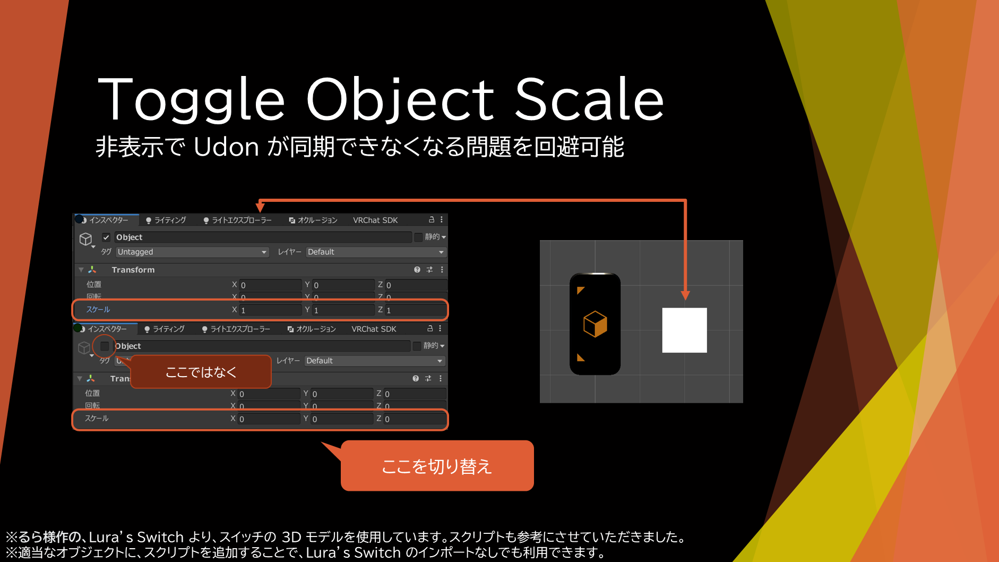
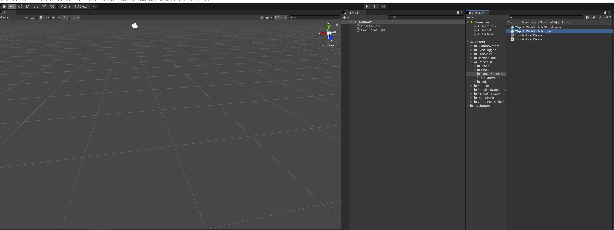

## Toggle Object Scale について

[Download Unitypackge](ToggleObjectScale.unitypackage)

### 何ができる？

    VRChat で、オブジェクトのスケールを、元のスケールと、0 で切り替える。

    (非表示では、非表示状態の間に Udon の同期ができないことがあった)

### 設置方法

    Lura's Switch の 3D モデルを使いたい場合は、あらかじめインポートしておきます。

    次に、Toggle Object Scale の UnityPackage をインポートします。

    Assets/Praecipua/ToggleObjectScale/Object_WithSwitch Local のプレハブを、Scene 内に置きます。

    プレハブ内の、Switch_Object で、設定変更をします。

    Lura's Switch をインポートしない場合は、オブジェクトに手動で U# Script を追加し、Box Collider も追加、トリガーにしてください。

### 使い方
    プレハブを置いた場合は、Switch_Object を、それ以外の場合は、スクリプトを追加したオブジェクトで、設定変更をします。

    スクリプトを追加したオブジェクトに、Box Colloder または Mesh Collider がついており、トリガーにする にチェックを入れていることを確認してください。

    - Interaction Text

        手を近づけたときなどに出るテキストです。

    - Is Global
        他人と同期するかを選択します。

    - Target Object Scale

        スケールを変更 (元のスケール ⇔ 0) するオブジェクトを指定する。

        サイズに、変更したいオブジェクトの数を入れ、その後、表示された枠に、変更したいオブジェクトを指定します。

    - Target Object Active

        ボタンを押したとき (Interact したとき) に、オンオフを切り替えできます。
        片方がオン、もう片方がオフの2つのオブジェクトを入れることで、切り替えの状態を分かりやすくできます。

        このオブジェクトは、スケールは切り替わりません。

        (プレハブの場合は、Lura's Switch のオンオフを表すオブジェクトがセットされています)

### バージョン履歴

    - 1.0 (2023-11-08)

        初回リリース。

### 使用アセット

    - Lura's Switch (仮想狐のデザイン工房, るら)

        https://booth.pm/ja/items/1969082

        - スイッチの 3D オブジェクト (Unitypackage には含まれていないんので、別途インポート必要)

        - スクリプト (参考にさせていただきました。Lura's Switch なしでも動きます)

### ライセンスについて

	Apache-2.0 License で配布します。

	要約を書いておきますが、正式な規約は原文が優先されます。

	私的利用・商用利用、修正、(再)配布などが許可、

	責任を負ったり保証はしない、商標登録はできない、

	再配布の条件として、ライセンスおよび著作権表示、変更部分の明示が必要。

    なお、別途用意して頂く、るら様のアセットは、るら様の利用規約が適用されます。(同梱していません)