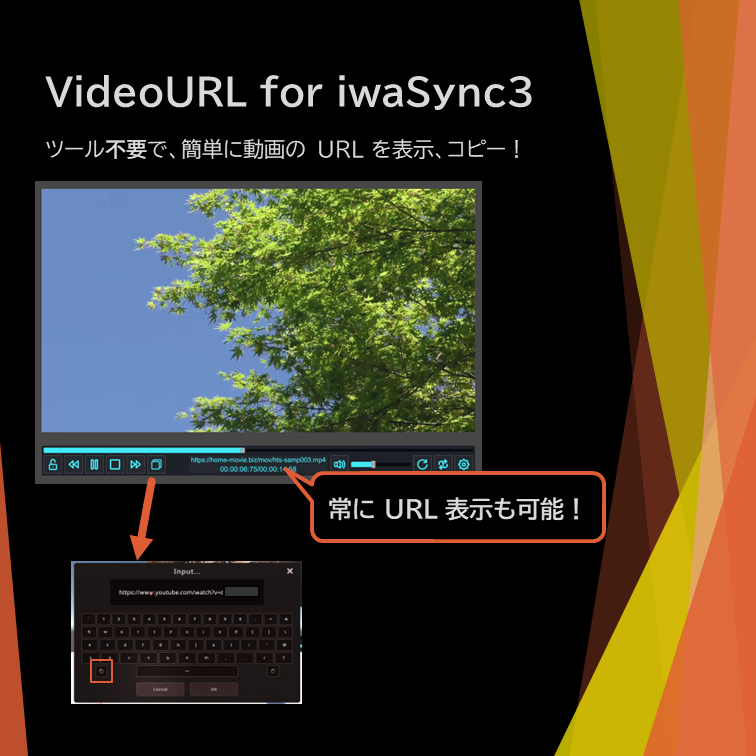
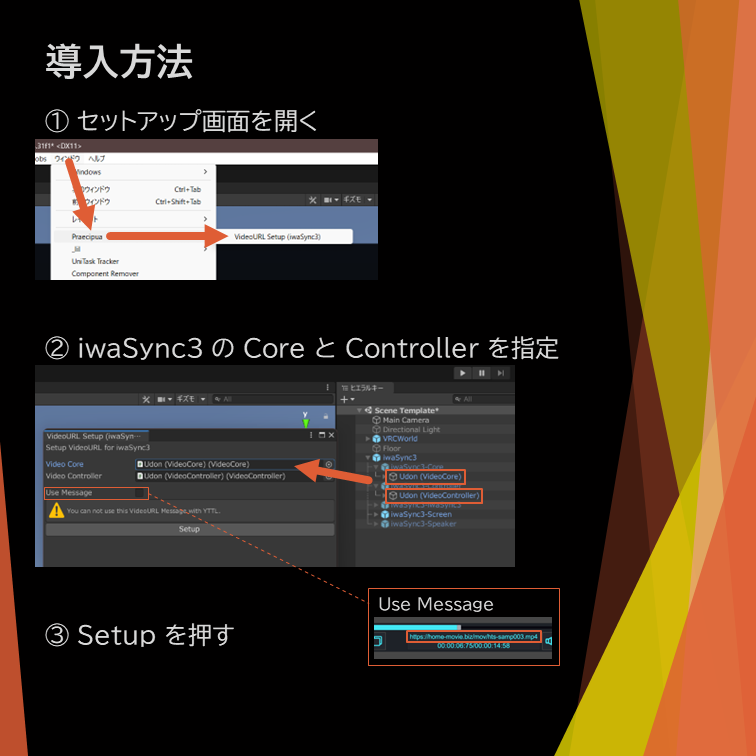
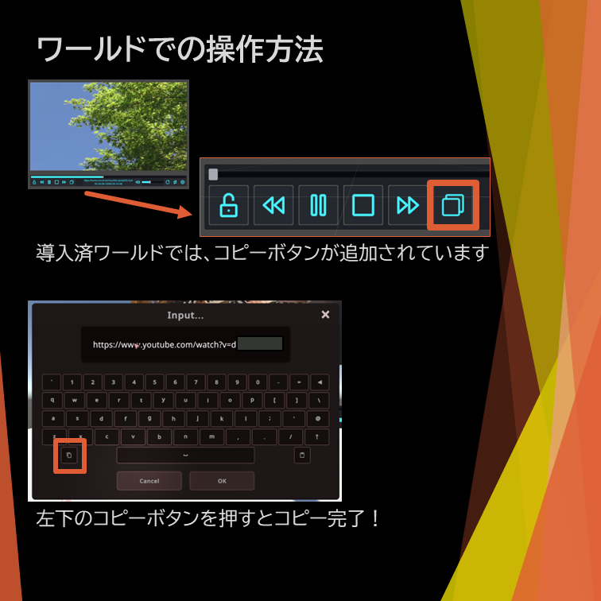

## VideoURL_iwaSync について

[Download Unitypackge](VideoURL_iwaSync3.unitypackage)

### 何ができる？

	iwaSync3 で再生中の URL を、表示したり、コピーできるようになる。

	(VRCX などを使わなくても、プレイヤーが再生中の URL を知れるようになる)

	

### 設置方法

	Scene 内に、あらかじめ iwaSync3 を配置しておきます。

	次に、Unity 画面上部の Window (日本語化していれば ウィンドウ) から、Praecipua/VideoURL Setup (iwaSync3) を開きます。

	Use Message にチェックを入れると、動画再生の時間が表示される部分の上部に URL が常に表示されるようになります。

	(ただし、ureishi さんの、動画タイトルを表示する YTTL とは、表示する位置がかぶってしまうため、併用はできません。)

	

### 使い方

	iwaSync3 で動画を再生すると、iwaSync3 のコントローラーの左側に並んでいるアイコンの一番右に、四角形が2つ重なっているようなボタンが追加されます。

	そのボタンを押すと、VRChat の InputField が表示され、その中に再生中の動画の URL が表示されます。

	Ctrl + C や、InputField の左側にあるコピーボタンなどでコピーしてください。

	Use Message で表示しているテキスト部分からはコピーはできません。

	

### バージョン履歴

	- 1.0 (2023-10-10)

		初回リリース。

### 既知の問題

	Message で URL を表示する場合、ureishi さんの YTTL という、動画タイトル表示ツールと競合し、どちらかが表示されない。

	これは、videoCore.Message というものを両者が使用しているためである。なお、修正する予定はない。
	
	(Message での表示機能にはそこまで需要を見込んでいないほか、代替方法はいくらかあるが、単にそれらの実装が面倒であるためである)

	- 以下 1.0.0 で修正済み (のはず)

	Unity 上でテストすると動くが、VRChat 内では、正常に動作しないことがある。

	(親オブジェクトである iwaSync3-Controller 内の Canvas が、デフォルトでは非アクティブ状態なためではないかと考えているが、動くときもあるので原因は不明)

	この問題は、ビルド時にはすでに発生するか否かが確定しており(Udon への変換、コンパイル時の問題?)、動かないワールドでは一切動かないし、動くワールドでは必ず動く。

	他人がいるときや、後から Join したときなどにどうなるかがまだ確認はできていない。

### ライセンスについて

	Apache-2.0 License で配布します。

	要約を書いておきますが、正式な規約は原文が優先されます。

	私的利用・商用利用、修正、(再)配布などが許可、
	
	責任を負ったり保証はしない、商標登録はできない、

	再配布の条件として、ライセンスおよび著作権表示、変更部分の明示が必要。

	なお、コピー のアイコンは、icons8 のものを一部加工したものを使用しており、その部分には、icons8 の定めるライセンスが別途適用されます。

	[Copy Icon by icons8](https://icons8.jp/icon/SiE2nqZBbw05/%E3%82%B3%E3%83%94%E3%83%BC)

### トラブルが気になる？

	- このツールは、iwaSync3 のアドオンのようなものであり、ワールド側で組み込まない限り使用できない。

		つまり、VRChat 内で再生している動画の URL をコピーされることが嫌であれば、ワールドにこのツールを導入しなければ良いだけのことである。

		そもそも、このツールを導入せずとも、VRCX などの外部のソフトウェアや、VRChat のログを読むことで、以前から再生している動画の URL は知ることができるはずであり、完全に知られたくないのであれば、VRChat 内でそのような動画を再生したりするべきではない。

	
	- 動画配信者などが、このツールを導入済みの iwaSync3 が配信画面に映り込むことにより、視聴者に非公開の動画のリンクが知られてしまうのではないかと懸念するかもしれない。

		しかし、再生時間の表示部分の上に表示する URL は、ワールド制作時に非表示に設定することができ (デフォルトはオフである)、そのような問題も回避できるはずである。

		(もっとも、ワールドの訪問者側で非表示にする設定ができるようにしてほしいという要望は考えられるため、後日の実装を検討する)

	- このツールは、iwaSync3 の利用規約違反になるのではないかと考える人もいるかもしれない。

		正直言って、なぜ iwaSync3 に VN3 ライセンスを用いたのか、権利者がどのように解釈しているのかが不明であるため、解釈次第でアウトといわれれば、それは否定できない。

		なお、当方では VN3 での「製品開発等んおためのソフトウェアへの組み込み」については、iwaSync3 のアセットのファイルは、このツールの Unitypackage 等に含まれていないことから、該当しないと考えている。