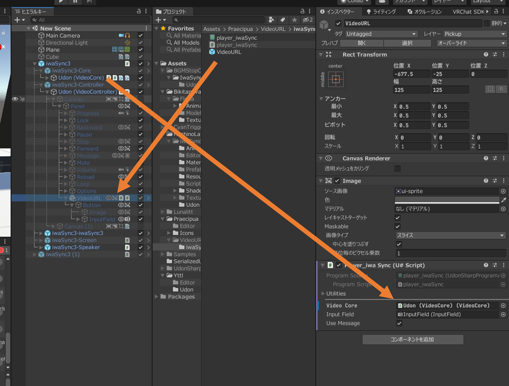

## VideoURL_iwaSync について

**何ができる？**
iwaSync3 で再生中の URL を、表示したり、コピーできるようになる。
(VRCX などを使わなくても、プレイヤーが再生中の URL を知れるようになる)

**設置方法**
Scene 内の iwaSync3-Controller/Udon (VideoCOntroller)/Canvas/Panell 内に、Assets/Praecipua/VideoURL/iwaSync/VideoURL.prefab を入れてください。
次に、Inspector 上で VideoURL についている Player_iwaSync にある、Video Core のところに、Scene 内の iwaSync3-Core/Udon (VideoCore) を指定します。
Use Message にチェックを入れると、動画再生の時間が表示される部分の上部に URL が常に表示されるようになります。

**使い方**
iwaSync3 で動画を再生すると、iwaSync3 のコントローラーの左側に並んでいるアイコンの一番右に、四角形が2つ重なっているようなボタンが追加されます。
そのボタンを押すと、VRChat の InputField が表示され、その中に再生中の動画の URL が表示されます。
Ctrl + C や、InputField の左側にあるコピーボタンなどでコピーしてください。
Use Message で表示しているテキスト部分からはコピーはできません。

**既知の問題**
- Unity 上でテストすると動くが、VRChat 内では、正常に動作しないことがある。
(親オブジェクトである iwaSync3-Controller 内の Canvas が、デフォルトでは非アクティブ状態なためではないかと考えているが、動くときもあるので原因は不明)

	この問題は、ビルド時にはすでに発生するか否かが確定しており(Udon への変換、コンパイル時の問題?)、動かないワールドでは一切動かないし、動くワールドでは必ず動く。

- 他人がいるときや、後から Join したときなどにどうなるかがまだ確認はできていない。
