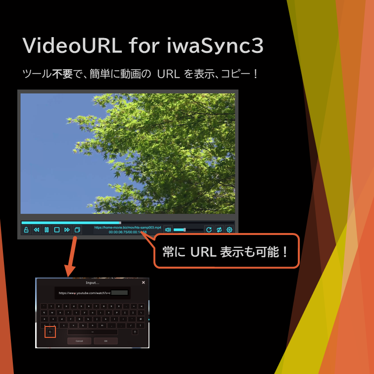
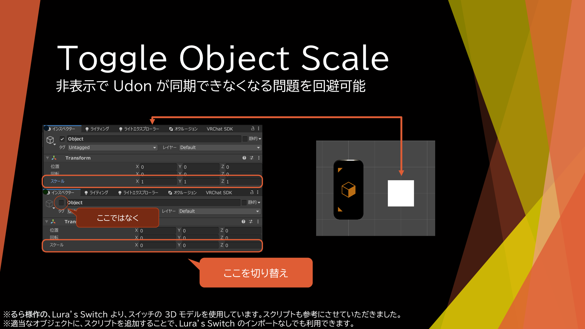

# Udon スクリプト置き場

本レポジトリで配布するファイルは、制作中の下書き程度のものもあり、操作方法のマニュアルの提供がない場合や、とんでもないバグ(認知済み)が含まれる可能性がある。

Booth で配布したり、Release にあるものは安定しているとは思いますが。

# 配布しているもの

## VideoURL_iwaSync

[Download Unitypackge](VideoURL_iwaSync3.unitypackage)

[細かい説明、導入方法等](VideoURL_iwaSync3_Readme.md)

## Toggle Object Scale

[Download Unitypackge](ToggleObjectScale.unitypackage)

[細かい説明、導入方法等](Toggle_Object_Scale_Readme.md)

### 何ができる？

	iwaSync3 で再生中の URL を、表示したり、コピーできるようになる。

	(VRCX などを使わなくても、プレイヤーが再生中の URL を知れるようになる)

    VRChat で、オブジェクトのスケールを、元のスケールと、0 で切り替える。

    (非表示では、非表示状態の間に Udon の同期ができないことがあった)

# 本レポジトリ内のファイルのライセンスについて

	別途指定があるものを除き、Apache-2.0 License で配布します。

	要約を書いておきますが、正式な規約は原文が優先されます。

	私的利用・商用利用、修正、(再)配布などが許可、

	責任を負ったり保証はしない、商標登録はできない、

	再配布の条件として、ライセンスおよび著作権表示、変更部分の明示が必要。